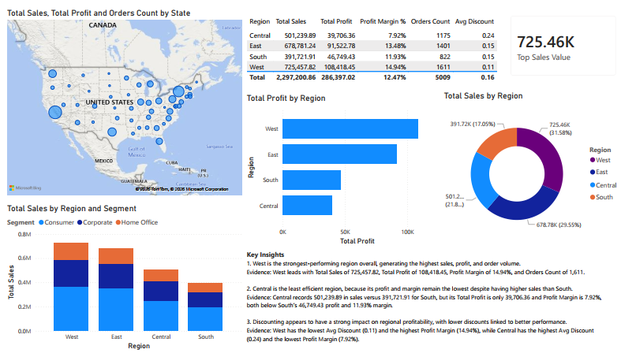

# Power BI Superstore Dashboard

## Project Overview
This project is a Power BI dashboard built using the Superstore dataset.  
It focuses on sales comparison, profit analysis, and regional performance.

## Tools Used
- Power BI
- Superstore dataset
- Basic DAX measures

## Dashboard Pages
### 1. Sales Comparison (2016–2017)
This page compares Actual 2017 and Plan 2016 performance by sub-category.

### 2. General Overview
This page provides an overview of total sales, total profit, profit margin, sub-category profit, and monthly profit trend.

### 3. Regional Performance Analysis
This page analyzes sales and profit across regions, states, and customer segments.

## Key Insights
- West is the strongest-performing region in terms of sales, profit, and orders.
- Central shows lower profitability efficiency despite relatively solid sales.
- Discount level appears to be associated with profit margin across regions.

## Dataset
Superstore dataset from Kaggle.

## Dashboard Preview

### Sales Comparison

### General Overview

### Regional Performance Analysis

